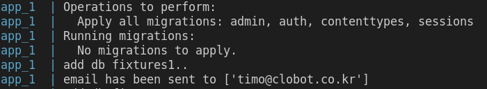
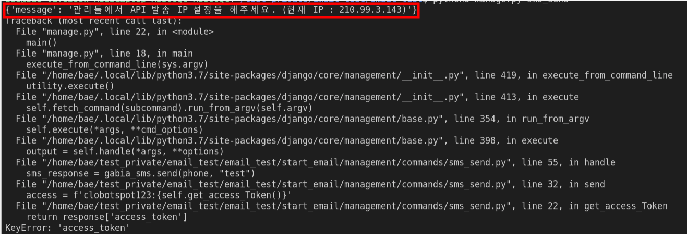

1. https://www.docker.com 접속하여 docker를 설치해 주세요

2. cd ~
3. git clone https://github.com/JaeWanBot/test_for_privateIP
4. cd  ~/test_for_privateIP/
5. settings.env 파일에 수신자 이메일을 추가해 주세요. 현재는 한 명만 가능합니다.

```
RECIPANTS='example@example.com'
PHONE=''
```


```
<br>가비아의 API는 특정 IP만 호출할 수 있음으로 해당 IP를 알려주시면 등록하겠습니다!</br>
```

1. <b>sudo docker-compose up</b> 해당 명령어를 입력하면 아래와 같이 email 및 sms를 받을 수 있습니다.

## Result




## Error
7. 아래와 같은 오류가 발생한다면 IP주소를 알려주시면 됩니다


    